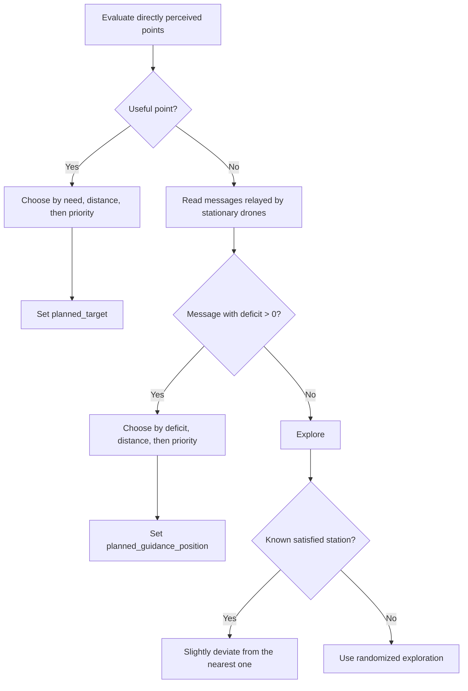

# Adaptive Coverage Simulation

An agent-based simulation of adaptive drone coverage over points of interest. The project uses a continuous two-dimensional environment, local perception, inter-drone communication, and real-time visualization of coverage and performance metrics.

## Current project focus

The current focus of the project is the decentralized **quadcopter** policy. This is the actively developed and reviewed part of the simulation and the main subject of the research work.

A fixed-wing platform is also included, but it is currently at an initial stage. It provides a preliminary implementation and useful comparison baseline, rather than a policy with the same level of development and validation as the quadcopter system.

The central quadcopter idea is that every staffed point has one authoritative owner. The owner estimates the station deficit, while support drones relay that estimate to nearby drones. No global occupancy value or point identifier is used by the quadcopter decision policy.

## Contents

- [Technology stack](#technology-stack)
- [Installation](#installation)
- [Running the simulation](#running-the-simulation)
- [Project structure](#project-structure)
- [Problem definition](#problem-definition)
- [Core decentralized principles](#core-decentralized-principles)
- [Quadcopter roles and operational conditions](#quadcopter-roles-and-operational-conditions)
- [Simulation pipeline](#simulation-pipeline)
- [Dynamic point lifecycle](#dynamic-point-lifecycle)
- [Owner communication and support relaying](#owner-communication-and-support-relaying)
- [Target selection](#target-selection)
- [Owner election and support placement](#owner-election-and-support-placement)
- [Overcrowding and departure](#overcrowding-and-departure)
- [Movement](#movement)
- [Parameters](#parameters)
- [Batch experiments and result analysis](#batch-experiments-and-result-analysis)
- [Data collection and plots](#data-collection-and-plots)

## Technology stack

The exact dependency versions are recorded in `uv.lock`.

| Technology | Version |
| --- | --- |
| Python | 3.14 |
| uv | 0.10.2 |
| Mesa | 3.5.1 |

## Installation

Install [uv](https://docs.astral.sh/uv/getting-started/installation/) if it is not already available, then clone the repository:

```bash
git clone https://github.com/Laud15/adaptive-coverage-simulation.git
cd adaptive-coverage-simulation
```

Install Python 3.14 and synchronize the environment using the locked dependencies:

```bash
uv python install 3.14
uv sync --frozen
```

## Running the simulation

Start the Solara application from the project root:

```bash
uv run -m solara run src/App.py
```

Open the local address displayed in the terminal. The interface provides simulation controls, adjustable model parameters, a real-time map, and optional performance plots.

## Project structure

```text
adaptive-coverage-simulation/
|-- src/
|   |-- Agents.py          # Drone and point-of-interest agents
|   |-- Model.py           # Simulation model, scheduling, and data collection
|   |-- App.py             # Solara interface and real-time visualization
|   |-- PointScenario.py   # Reusable dynamic point-event routines
|   |-- run_batch.py       # Reproducible batch experiment execution
|   `-- analyze_results.py # Saved-result analysis and figure generation
|-- results/               # Generated experiment outputs, ignored by Git
|-- pyproject.toml         # Project metadata and direct dependencies
|-- uv.lock                # Reproducible dependency lock file
|-- LICENSE
`-- README.md
```

## Problem definition

The simulation contains:

- points of interest, represented by `TargetAgent` objects;
- drones, represented by either `QuadcopterDrone` or the preliminary `FixedWingDrone` implementation;
- a continuous two-dimensional territory;
- a required drone quota for every point, stored as `priority`;
- a stationing area around every point, defined by `coverage_radius`.

Points remain fixed in space throughout their lifetime. Their active set and
requested quotas may nevertheless change at the beginning of a simulation
step through deterministic events supplied to the model.

For a point with priority \(p\) and authoritative local occupancy estimate \(o\), the deficit is:

```text
deficit = p - o
```

Its interpretation is:

- `deficit > 0`: the point still needs drones;
- `deficit == 0`: the point has exactly the requested number of drones;
- `deficit < 0`: the point is overcrowded.

The objective is to reduce the total residual deficit while using information obtained through local perception and local communication.

### Study area and flight buffer

`width` and `height` define the study area in which points are generated. A buffer surrounds this rectangle on every side and belongs to the drone flight space. Initial drone deployments may use the complete flight space, including the buffer.

By default:

```text
flight_buffer = coverage_radius + speed
```

The outer `ContinuousSpace` therefore has dimensions:

```text
flight_width = width + 2 * flight_buffer
flight_height = height + 2 * flight_buffer
```

With the default parameters, the study area is `100 x 100`, the buffer is `9` units on every side, and the complete flight space is `118 x 118`. The map draws the study-area boundary explicitly; the surrounding region is the maneuvering buffer.

## Core decentralized principles

The quadcopter policy follows these rules:

1. A drone perceives points only within `point_sensing_radius`.
2. It perceives and communicates with drones only within `drone_sensing_radius`.
3. The sensing radii are independent during perception: `perceive()` queries the larger radius and filters points and drones separately.
4. Point association never uses a point identifier. Points are associated geometrically through their positions, within `EPS`.
5. `TargetAgent.occupancy` is global ground truth used only for metrics and visualization. Quadcopter decisions do not read it.
6. For a staffed point, only the owner calculates and publishes the authoritative deficit.
7. Supports do not calculate independent occupancy estimates. They relay the owner's value.
8. `unique_id` is used only as a deterministic tie-break between locally visible drone candidates, never to identify points.

The model enforces the following core geometry and coordination constraints:

- flight_buffer >= coverage_radius + speed, so every stationing zone has room for one complete exit step before the world
boundary;
- `coverage_radius <= point_sensing_radius`, so a drone cannot cover a point without perceiving it;
- for quadcopters, `drone_sensing_radius >= point_sensing_radius`, so a quadcopter that perceives a staffed point also perceives its owner at the center;
- for both platforms, `drone_sensing_radius >= separation`, so every drone close enough to activate separation has already been perceived;
- for quadcopters, `0 < support_inset < coverage_radius`;
- for fixed-wing drones, `cohere > 0` and `speed / cohere < coverage_radius`.

Additional validation keeps world and point margins within the territory, physical scale values positive, and delay and angle parameters non-negative.

## Quadcopter roles and operational conditions

The stationary role is represented by `station_role`:

| Stationary role | Representation | Meaning |
| --- | --- | --- |
| None | `station_role is None` | The drone has no stationary role; this alone does not identify its movement condition |
| Owner | `station_role == "owner"` | Authoritative drone, stationary at the point center |
| Support | `station_role == "support"` | Stationary drone helping cover the owner's point |

The main operational conditions without a stationary role include exploration, travel toward a target or communicated station, owner candidacy, support relocation, and departure. In particular:

| Transitional condition | Representation | Meaning |
| --- | --- | --- |
| Support relocation | `support_destination is not None` | Moving toward its inner radial position; not yet a support |
| Departure | `departing_from is not None` | Leaving an overcrowded point along the remembered entry direction |

The destination fields have distinct meanings:

- `target`: a point perceived directly by the drone;
- `guidance_position`: the center of a station known through a stationary drone's message;
- `avoid_position`: the center of a satisfied station from which the drone should deviate slightly;
- `support_destination`: the inner radial position that must be reached before becoming a support;
- `departing_from`: the point whose stationing area is being left.

`target` and `guidance_position` are intentionally separate. Direct perception permits the owner/support policy to be applied, while guidance supplies only a direction toward a station whose point is not yet visible.

## Simulation pipeline

`CoverageModel.step()` separates the simulation into global phases. Every drone completes one phase before any drone begins the next one.

```mermaid
flowchart LR
    A["Current state"] --> B["Apply scheduled point events"]
    B --> C["TargetAgent.step()"]
    C --> D["perceive()"]
    D --> E["communicate()"]
    E --> F["decide_target()"]
    F --> G["decide_station()"]
    G --> H["commit_decision()"]
    H --> I["move()"]
    I --> J["Update ground-truth occupancy"]
    J --> K["Collect data"]
    K --> L["New current state"]
```



Scheduled point events are applied by the model before drone perception. They
modify the environment but are not communicated globally to the decentralized
policy. Newly created points must therefore be discovered through normal local
perception and subsequent station messages. `TargetAgent.step()` remains a
no-op because lifecycle changes that modify the agent set belong to the model.

The `planned_*` fields buffer decisions between phases. A drone therefore reads stable current state from its neighbors instead of observing a partially applied next state caused by Mesa's internal execution order.

The principal current/planned pairs are:

- `target` / `planned_target`;
- `exploring` / `planned_exploring`;
- `station_role` / `planned_station_role`;
- `guidance_position` / `planned_guidance_position`;
- `avoid_position` / `planned_avoid_position`.

`planned_support_relocation` and `planned_departing` buffer the two transitional decisions.

`release_candidate_id` is instead a temporary owner message: it is produced during `communicate()`, read by supports during `decide_station()`, and reset before the next communication decision. The selected support buffers its own state change through `planned_departing`.

## Dynamic point lifecycle

`CoverageModel` supports two levels of point-event definition. A named
`point_routine` describes high-level environmental changes and is convenient
for the interactive application and repeatable experiments.
`build_point_events()` converts that routine into the low-level `point_events`
calendar executed by the model.

A `reconfigure` routine event replaces all active points with a new geometric
configuration. Until a `change_priority_range` event occurs, newly generated
points inherit the initial inclusive interval defined by `min_priority` and
`max_priority`. A `change_priority_range` event assigns new quotas to all
active points and becomes the interval used by later reconfigurations. Random
positions and quotas generated by a routine use the independent `event_seed`.

The current `dynamic_demo` routine is only a technical demonstration of the
event mechanism. It does not represent an application-specific scenario.

`CoverageModel` accepts an optional `point_events` sequence. Each event is a
dictionary containing an integer `step` greater than or equal to one and one of
the following actions:

```python
point_events = [
    {
        "step": 20,
        "action": "create",
        "position": (40.0, 60.0),
        "priority": 2,
    },
    {
        "step": 40,
        "action": "change_priority",
        "point_idx": 0,
        "new_priority": 3,
    },
    {
        "step": 60,
        "action": "remove",
        "point_idx": 0,
    },
]
```

Events scheduled for the same step are applied in the order in which they
appear in `point_events`. Event dictionaries are grouped internally by step,
while action-specific values are validated by the corresponding lifecycle
operation when the event is executed.

The model manages active points through both an ordered `target_agents` list
and a `target_agents_by_idx` dictionary. Initial points receive indices from
zero to `n_points - 1`; later indices increase monotonically and are never
reused. These indices support model management, experiments, metrics, and
optional per-agent data. They are not available to the decentralized drone policy, which
continues to associate points geometrically.

`create_point()` does not impose a minimum distance between active point
centers. Because the drone policy treats positions within `EPS` as the same
station, experiment scenarios should not keep conceptually distinct active
points at coincident positions unless that equivalence is intentional. A point
may instead be created at the position of a previously removed point and still
receive a new, non-reused index.

- `create_point()` creates and registers a `TargetAgent` in the Mesa model,
  continuous space, active-point list, and index dictionary. Its position must
  lie within the study-area bounds allowed by `point_margin`, and its quota
  must be a positive integer. An explicit non-reused `point_idx` is optional.
- `change_point_priority()` changes the positive integer quota of an active
  point without changing its identity or fixed position.
- `remove_point()` first clears current and buffered drone state that refers
  directly to the point, then removes the point from both project registries,
  the Mesa model, and the continuous space.

When an associated point dies, owners, supports, drones traveling directly to
it, relocating drones, and departing drones lose the corresponding target,
role, and transition state and immediately return to exploration. A departing
drone does not complete the radial exit, because the station no longer exists.
The normal perception and decision phases then run on the updated environment,
so the drone may select another useful destination during the same step.
Perception snapshots from the preceding step are overwritten by `perceive()`
before any decision phase reads them.

Birth, death, and quota changes remain exogenous: the event calendar never
uses drone state to decide whether an event occurs. A point born during a step
is available to that step's perception phase, and an owner uses a changed quota
in the subsequent communication phase.

## Owner communication and support relaying

### Owner calculation

Only a quadcopter whose current role is `owner` calculates a station deficit. The owner verifies that it is not departing, still perceives its target, and remains inside the target's coverage radius.

It calculates occupancy by:

1. counting itself;
2. inspecting locally visible quadcopters;
3. counting only drones whose role is `owner` or `support`;
4. excluding departing drones;
5. counting a neighbor only when it lies inside the target's coverage radius.

The owner then publishes:

```text
advertised_deficit = target.priority - locally_counted_occupancy
```

Drones without an owner or support role, including relocating and departing drones, are not part of the station occupancy estimate.

### Support relaying

A support never replaces the owner's value with its own estimate. It geometrically identifies the authoritative owner for its target and relays that owner's `advertised_deficit`.

```text
owner calculates deficit
        ↓
support reads owner's deficit
        ↓
nearby nonstationary drone receives the same authoritative deficit
```

This creates a one-hop extension of the owner's communication reach without introducing competing occupancy estimates.

When several stationary drones communicate information about the same geometric point, messages are deduplicated. A direct owner message is preferred over a support relay; between sources of the same type, the nearer source is preferred.

## Target selection

`decide_target()` always evaluates directly perceived points before messages from stationary drones.

### Direct points first

For each perceived point, the drone geometrically searches for a visible owner:

- no owner: the point is eligible and the drone may approach it;
- owner with `deficit > 0`: the point is eligible because it still needs drones;
- owner with `deficit <= 0`, or temporarily unavailable information: the point is not selected and becomes an avoidance candidate.

The drone never replaces an unavailable owner's estimate with a support-side or explorer-side occupancy calculation.

If several directly perceived points are useful, selection uses:

1. greater need, defined as the owner's deficit or the priority of an ownerless point;
2. shorter distance to the point center when need is equal;
3. greater point priority when both previous values are equal.

### Station messages second

Messages from stationary drones are considered only when no directly perceived point is useful. Only messages with `deficit > 0` attract the drone.

If several requests exist, selection uses:

1. greater deficit;
2. shorter distance to the communicated station center when deficits are equal;
3. greater priority when both previous values are equal.

The result becomes `guidance_position`, not `target`, because the point itself has not yet been perceived directly.

### Exploration and avoidance

If there is no useful direct point and no positive station request, the drone explores. Satisfied or overcrowded stations become avoidance candidates. The nearest candidate is selected, with priority used only as a tie-break.

Avoidance is implemented as a slight route deviation, not as a new destination or a strong repulsive force.



## Owner election and support placement

Stationing decisions begin only when a drone is physically inside the coverage radius of its directly perceived `planned_target`.

If an owner already exists, the arriving drone relocates toward an inner support position.

If no owner exists, the drone considers itself and locally visible quadcopters that:

- are not departing;
- have the same geometrically associated `planned_target`;
- are already inside coverage.

The winner is selected by:

1. shortest distance from the point center;
2. lower `unique_id` if distances are equal.

The election becomes effective only when the best candidate reaches the center within `EPS`. Until then, candidates continue approaching the center. This prevents an owner from becoming stationary at the coverage boundary.

When the winner reaches the center:

- the winner becomes owner;
- the other candidates relocate to support positions.

Because all drones complete the election phase before roles are committed, candidates that reach the center in the same step apply the same distance and `unique_id` ordering. Only one owner can therefore be elected for each geometric point.

Supports stop inside the coverage boundary at:

```text
support_radius = coverage_radius - support_inset
```

The support position lies along the outward radial direction associated with the side from which the drone entered the station. Placing supports inside the boundary provides tolerance against numerical or positional noise.

## Overcrowding and departure

Overcrowding exists when the owner reports `deficit < 0`.

The owner never leaves merely because the point is overcrowded. Only supports can be selected for departure.

During `communicate()`, an overcrowded owner builds a local list of eligible supports. A drone is eligible only when it is visible to the owner, currently has the `support` role, is not departing, lies within the station's coverage radius, and is geometrically associated with the owner's point.

If at least one eligible support exists, the owner selects the one with the lowest `unique_id` and publishes its ID through `release_candidate_id`. This decision is temporary and is reset at the beginning of the next communication phase.

During `decide_station()`, every support finds the authoritative owner associated with its point. Only the support whose `unique_id` matches the owner's `release_candidate_id` plans a departure. All other supports remain stationary.

At most one support per station begins departing during each step. During the following step, the owner recomputes the deficit from the updated stationing state and decides whether another support must be released.

A departing support follows the same outward radial direction stored when it entered the station. After crossing the coverage boundary, it clears its stationing state and resumes exploration.

## Movement

`move()` executes the current state after decisions have been committed. Its branch priority is:

1. departure from a station;
2. relocation toward a support position;
3. owner or support holding station;
4. exact final approach to the target center;
5. normal flight.

Owners and supports remain stationary at their reached positions. An owner candidate that is within one movement step of the center moves exactly onto it, preventing overshoot and oscillation.

During normal flight:

- `target` produces attraction toward a directly perceived point;
- `guidance_position` produces attraction toward a communicated station center;
- `avoid_position` slightly rotates the route away from a satisfied station;
- otherwise, the drone follows randomized exploration.

Normal flight also combines separation, alignment, and boundary forces. The resulting direction is normalized, and `_clip_position()` keeps the drone inside the simulated territory.

Neighbor positions, directions, and movement states are copied during
`perceive()` and remain unchanged throughout the movement phase. Separation
considers both moving and stationary drones inside the separation radius; its
contribution increases linearly as distance decreases. Alignment instead uses
only neighbors that were moving in the perception snapshot, because a
stationary drone's retained direction does not represent current motion.

Quadcopters use a smaller boundary-force margin than fixed-wing drones because they can turn in place and require less advance warning near an edge.

## Parameters

`CoverageModel` accepts the environment and behavioral parameters below. The
Solara interface exposes the main interactive subset, including
`point_routine` and `event_seed`. The low-level `point_events` calendar is
instead passed programmatically by a scenario or experiment.

| Parameter | Meaning |
| --- | --- |
| `n_drones` | Number of drones |
| `n_points` | Number of points of interest created initially |
| `min_priority` | Inclusive lower bound of the initial integer quota range; setting it equal to `max_priority` gives every initial point the same quota |
| `max_priority` | Inclusive upper bound of the initial integer quota range |
| `point_layout` | Initial geometric distribution of points |
| `point_events` | Optional low-level deterministic calendar of point birth, death, and quota-change events |
| `point_routine` | Named high-level routine compiled into a low-level point-event calendar |
| `event_seed` | Independent seed used to generate positions and quotas required by a point routine |
| `drone_type` | `quadcopter` or preliminary `fixed_wing` platform |
| `deployment` | Initial drone deployment pattern |
| `speed` | Distance traveled per simulation step; with the adopted experimental scale, `speed=1` corresponds to 1 m/s |
| `meters_per_unit` | Conversion factor from one spatial unit to meters |
| `seconds_per_step` | Conversion factor from one simulation step to seconds |
| `point_sensing_radius` | Distance within which points are perceived |
| `drone_sensing_radius` | Distance within which drones are perceived and communicate |
| `coverage_radius` | Distance from a point within which stationing is possible |
| `separation` | Distance below which the separation force activates |
| `separate` | Strength of the separation force |
| `cohere` | Attraction strength toward a destination |
| `match` | Alignment strength between nearby drones |
| `explore` | Random exploration strength |
| `beta` | Travel-distance cost used by the preliminary fixed-wing utility policy; it is not used by the quadcopter policy |
| `avoid_angle_degrees` | Deviation angle away from a satisfied station |
| `support_inset` | Distance by which supports stop inside the coverage boundary |
| `release_delay_max_steps` | Maximum random overcrowding delay used only by the preliminary fixed-wing policy |

`separation` and `separate` are intentionally distinct: the first is a distance, while the second is a force coefficient.

The current experimental protocol adopts `meters_per_unit=1`,
`seconds_per_step=1`, and `speed=1`. Therefore one spatial unit is one meter,
one simulation step is one second, and the nominal drone speed is 1 m/s.

## Batch experiments and result analysis

`src/run_batch.py` executes reproducible parameter sweeps with Mesa's
`batch_run()`. Before starting an experiment, configure its name, duration,
model parameters, and explicit random seeds in the script. A scalar parameter
value is held fixed, while a list of values defines a parameter to sweep.
Mesa creates every combination of the supplied parameter values and repeats
each configuration once for every seed. Therefore:

```text
total runs = parameter-value combinations * number of seeds
```

Using the same seed list for every configuration supports paired comparisons
under corresponding pseudorandom conditions. Each run is still an independent
`CoverageModel` instance: model parameters do not change during a run unless
the change is explicitly part of the environmental point-event scenario.

Run the configured batch from the project root:

```bash
uv run src/run_batch.py
```

The script validates the required output columns, the number of runs, the
number of collected rows, and the relationship between simulation steps and
physical time before saving anything. It then creates one directory named
after the experiment. An existing experiment directory is never overwritten:
use a new experiment name or explicitly remove results that are no longer
needed before running the batch again.

Configure `EXPERIMENT_NAME` in `src/analyze_results.py` with the same name used
by the batch script. `COMPARISON_PARAMETERS` must contain the model parameters
that distinguish the configurations to be compared. Then analyze the saved
results without rerunning the simulation:

```bash
uv run src/analyze_results.py
```

Each experiment uses the following directory structure:

```text
results/
`-- <experiment_name>/
    |-- experiment_config.json
    |-- raw_results.csv
    |-- summaries/
    |   |-- run_summary.csv
    |   |-- aggregate_summary.csv
    |   |-- time_series_summary.csv
    |   `-- event_response_summary.csv
    `-- figures/
        |-- normalized_deficit.png
        |-- capacity_adjusted_coverage.png
        |-- deficit_reduction.png
        |-- point_service_state.png
        |-- fleet_state.png
        |-- scenario_characteristics.png
        |-- j_delta_comparison.png
        |-- time_to_90_percent_nominal_service.png
        `-- event_response_time.png  # Dynamic experiments only
```

The generated files have distinct roles:

- `experiment_config.json` records the experiment name, duration, collection
  period, process count, seeds, model parameters, the saved high-level point
  routine definition, and compact event markers with step, simulated time, and
  event type;
- `raw_results.csv` contains the observations collected for every run and
  simulation step;
- `run_summary.csv` contains one summary row for each independent model run,
  including `J_delta` and the first time at which 90% of nominally obtainable
  service is reached. For dynamic experiments it also reports the event
  episodes, the episodes reaching the same threshold, and their mean response
  time within the run;
- `aggregate_summary.csv` reports means and sample standard deviations across
  replications of each parameter configuration, together with the number of
  runs that reach the 90% threshold. Dynamic response times are first averaged
  within each run and then summarized across independent runs;
- `time_series_summary.csv` reports step-by-step means and sample standard
  deviations for every configuration;
- `event_response_summary.csv` contains one auditable row for each run and
  observable event episode, including its response window, reached/not-reached
  outcome, and time to 90% of nominally obtainable service;
- `figures/` contains the time-series and aggregate comparison plots generated
  from the saved tables. In dynamic experiments, every time-series plot marks
  the saved environmental-event times with labeled dashed vertical lines;
  static experiments contain no event lines. `event_response_time.png` is
  generated only when event episodes are present.

The complete `results/` directory is ignored by Git because experiment outputs
can be large and are generated artifacts. Results required for analysis or for
the thesis must therefore be preserved separately or regenerated from the
recorded configuration and repository version; they are not included in a
normal commit or push.

## Data collection and plots

After movement, `CoverageModel.update_occupancy()` recomputes global ground truth.

For quadcopters, a drone contributes to occupancy only when it is geometrically inside a point's coverage radius and its current role is `owner` or `support`. Quadcopters without a stationary role, including relocating and departing drones, are not counted. Fixed-wing occupancy retains the preliminary implementation's geometric definition.

Ground-truth occupancy is used by the data collector, plots, and visualization. It is never fed back into the decentralized quadcopter decision policy.

The interface can display:

- `residual_deficit`: total number of missing drone assignments;
- `idle_drones`: drones not currently covering any point;
- `exploring_drones`: drones with no useful destination currently known;
- `stationing_drones`: drones whose current role is `owner` or `support`;
- `underserved_points`: points whose occupancy is below their priority;
- `exactly_satisfied_points`: points whose occupancy equals their priority;
- `overserved_points`: points whose occupancy exceeds their priority;
- `active_points`: current number of active points;
- `total_demand`: sum of the quotas of the currently active points.

The data collector additionally records:

- `normalized_deficit`: residual deficit divided by the current total demand,
  or zero when no point is active;
- `overlapping_zones`: number of pairs of coverage zones whose interiors
  overlap;
- `unavoidable_deficit`: `max(0, total_demand - n_drones)`, which is only a
  valid resource lower bound when each drone contributes to at most one point;
- `simulated_time_s`: simulated physical time associated with the collected row.

`src/analyze_results.py` derives `capacity_adjusted_coverage`, mean demand per
point, fleet load, normalized structural deficit, normalized deficit reduction,
`J_delta`, and the first time at which each run reaches 90% of nominally
obtainable service. A run that never reaches the threshold retains a missing
time value; aggregate output reports both the conditional mean among reached
runs and the reached-run count.

Every time-series figure uses simulated seconds on the horizontal axis and
states that one step equals one second. Primary curves show the mean across
replications with a mean +/- one sample standard deviation band. This band is
not a confidence interval. The normalized-deficit figure also shows the
conditional structural reference, while the capacity-adjusted-coverage figure
shows the 90% threshold.

The first row is collected at time zero before any event or movement. Later
rows are collected after point events, drone decisions, movement, and the
ground-truth occupancy update for the corresponding step. Per-agent collection
is optional and disabled by default.

The map uses point color to show coverage state, point size and labels to show priority, drone color to show operational state, and a star marker to identify quadcopter owners.
