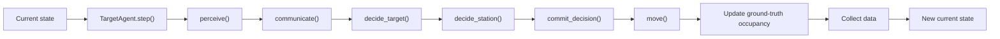
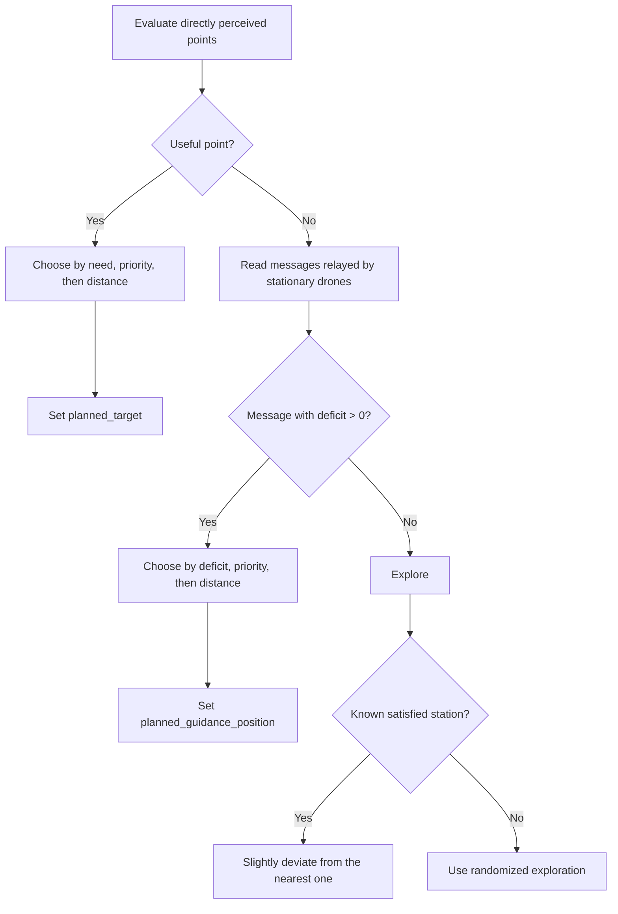

# Adaptive Coverage Simulation

An agent-based simulation of adaptive drone coverage over points of interest. The project uses a continuous two-dimensional environment, local perception, inter-drone communication, and real-time visualization of coverage and performance metrics.

## Current project focus

The current focus of the project is the decentralized **quadcopter** policy. This is the actively developed and reviewed part of the simulation and the main subject of the research work.

A fixed-wing platform is also included, but it is currently at an initial stage. It provides a preliminary implementation and useful comparison baseline, rather than a policy with the same level of development and validation as the quadcopter system.

The central quadcopter idea is that every staffed point has one authoritative owner. The owner estimates the station deficit, while support drones relay that estimate to nearby drones. No global occupancy value or point identifier is used by the quadcopter decision policy.

## Contents

- [Technology stack](#technology-stack)
- [Installation](#installation)
- [Running the simulation](#running-the-simulation)
- [Project structure](#project-structure)
- [Problem definition](#problem-definition)
- [Core decentralized principles](#core-decentralized-principles)
- [Quadcopter roles](#quadcopter-roles)
- [Simulation pipeline](#simulation-pipeline)
- [Owner communication and support relaying](#owner-communication-and-support-relaying)
- [Target selection](#target-selection)
- [Owner election and support placement](#owner-election-and-support-placement)
- [Overcrowding and departure](#overcrowding-and-departure)
- [Movement](#movement)
- [Parameters](#parameters)
- [Data collection and plots](#data-collection-and-plots)

## Technology stack

The exact dependency versions are recorded in `uv.lock`.

| Technology | Version |
| --- | --- |
| Python | 3.14 |
| uv | 0.10.2 |
| Mesa | 3.5.1 |

## Installation

Install [uv](https://docs.astral.sh/uv/getting-started/installation/) if it is not already available, then clone the repository:

```bash
git clone https://github.com/Laud15/adaptive-coverage-simulation.git
cd adaptive-coverage-simulation
```

Install Python 3.14 and synchronize the environment using the locked dependencies:

```bash
uv python install 3.14
uv sync --frozen
```

## Running the simulation

Start the Solara application from the project root:

```bash
uv run -m solara run src/App.py
```

Open the local address displayed in the terminal. The interface provides simulation controls, adjustable model parameters, a real-time map, and optional performance plots.

## Project structure

```text
adaptive-coverage-simulation/
|-- src/
|   |-- Agents.py   # Drone and point-of-interest agents
|   |-- Model.py    # Simulation model, phase scheduling, and data collection
|   `-- App.py      # Solara interface and real-time visualization
|-- pyproject.toml  # Project metadata and direct dependencies
|-- uv.lock         # Reproducible dependency lock file
|-- LICENSE
`-- README.md
```

## Problem definition

The simulation contains:

- points of interest, represented by `TargetAgent` objects;
- drones, represented by either `QuadcopterDrone` or the preliminary `FixedWingDrone` implementation;
- a continuous two-dimensional territory;
- a required drone quota for every point, stored as `priority`;
- a stationing area around every point, defined by `coverage_radius`.

For a point with priority \(p\) and authoritative local occupancy estimate \(o\), the deficit is:

```text
deficit = p - o
```

Its interpretation is:

- `deficit > 0`: the point still needs drones;
- `deficit == 0`: the point has exactly the requested number of drones;
- `deficit < 0`: the point is overcrowded.

The objective is to reduce the total residual deficit while using information obtained through local perception and local communication.

## Core decentralized principles

The quadcopter policy follows these rules:

1. A drone perceives points only within `point_sensing_radius`.
2. It perceives and communicates with drones only within `drone_sensing_radius`.
3. The sensing radii are independent during perception: `perceive()` queries the larger radius and filters points and drones separately.
4. Point association never uses a point identifier. Points are associated geometrically through their positions, within `EPS`.
5. `TargetAgent.occupancy` is global ground truth used only for metrics and visualization. Quadcopter decisions do not read it.
6. For a staffed point, only the owner calculates and publishes the authoritative deficit.
7. Supports do not calculate independent occupancy estimates. They relay the owner's value.
8. `unique_id` is used only as a deterministic tie-break between locally visible drone candidates, never to identify points.

The model enforces the following core geometry and coordination constraints:

- `point_margin >= coverage_radius + speed`, so every stationing zone has room for one complete exit step before the world
boundary;
- `coverage_radius <= point_sensing_radius`, so a drone cannot cover a point without perceiving it;
- for quadcopters, `drone_sensing_radius >= point_sensing_radius`, so a quadcopter that perceives a staffed point also perceives its owner at the center;
- for both platforms, `drone_sensing_radius >= separation`, so every drone close enough to activate separation has already been perceived;
- for quadcopters, `0 < support_inset < coverage_radius`;
- for fixed-wing drones, `cohere > 0` and `speed / cohere < coverage_radius`.

Additional validation keeps world and point margins within the territory, physical scale values positive, and delay and angle parameters non-negative.

## Quadcopter roles

A quadcopter can be in one of the following operational conditions:

| Condition | Representation | Meaning |
| --- | --- | --- |
| Free | `station_role is None` | Exploring or traveling without a stationing role |
| Owner | `station_role == "owner"` | Authoritative drone, stationary at the point center |
| Support | `station_role == "support"` | Stationary drone helping cover the owner's point |
| Support relocation | `support_destination is not None` | Moving toward its inner radial position; not yet a support |
| Departure | `departing_from is not None` | Leaving an overcrowded point along the remembered entry direction |

The destination fields have distinct meanings:

- `target`: a point perceived directly by the drone;
- `guidance_position`: the center of a station known through a stationary drone's message;
- `avoid_position`: the center of a satisfied station from which the drone should deviate slightly;
- `support_destination`: the inner radial position that must be reached before becoming a support;
- `departing_from`: the point whose stationing area is being left.

`target` and `guidance_position` are intentionally separate. Direct perception permits the owner/support policy to be applied, while guidance supplies only a direction toward a station whose point is not yet visible.

## Simulation pipeline

`CoverageModel.step()` separates the simulation into global phases. Every drone completes one phase before any drone begins the next one.



The `planned_*` fields buffer decisions between phases. A drone therefore reads stable current state from its neighbors instead of observing a partially applied next state caused by Mesa's internal execution order.

The principal current/planned pairs are:

- `target` / `planned_target`;
- `exploring` / `planned_exploring`;
- `station_role` / `planned_station_role`;
- `guidance_position` / `planned_guidance_position`;
- `avoid_position` / `planned_avoid_position`.

`planned_support_relocation` and `planned_departing` buffer the two transitional decisions.

## Owner communication and support relaying

### Owner calculation

Only a quadcopter whose current role is `owner` calculates a station deficit. The owner verifies that it is not departing, still perceives its target, and remains inside the target's coverage radius.

It calculates occupancy by:

1. counting itself;
2. inspecting locally visible quadcopters;
3. counting only drones whose role is `owner` or `support`;
4. excluding departing drones;
5. counting a neighbor only when it lies inside the target's coverage radius.

The owner then publishes:

```text
advertised_deficit = target.priority - locally_counted_occupancy
```

Free, relocating, and departing drones are not part of the station occupancy estimate.

### Support relaying

A support never replaces the owner's value with its own estimate. It geometrically identifies the authoritative owner for its target and relays that owner's `advertised_deficit`.

```text
owner calculates deficit
        ↓
support reads owner's deficit
        ↓
nearby free drone receives the same authoritative deficit
```

This creates a one-hop extension of the owner's communication reach without introducing competing occupancy estimates.

When several stationary drones communicate information about the same geometric point, messages are deduplicated. A direct owner message is preferred over a support relay; between sources of the same type, the nearer source is preferred.

## Target selection

`decide_target()` always evaluates directly perceived points before messages from stationary drones.

### Direct points first

For each perceived point, the drone geometrically searches for a visible owner:

- no owner: the point is eligible and the drone may approach it;
- owner with `deficit > 0`: the point is eligible because it still needs drones;
- owner with `deficit <= 0`, or temporarily unavailable information: the point is not selected and becomes an avoidance candidate.

The drone never replaces an unavailable owner's estimate with a support-side or explorer-side occupancy calculation.

If several directly perceived points are useful, selection uses:

1. greater need, defined as the owner's deficit or the priority of an ownerless point;
2. greater point priority when need is equal;
3. shorter distance when both previous values are equal.

### Station messages second

Messages from stationary drones are considered only when no directly perceived point is useful. Only messages with `deficit > 0` attract the drone.

If several requests exist, selection uses:

1. greater deficit;
2. greater priority when deficits are equal;
3. shorter distance to the communicating stationary drone when deficit and priority are equal.

The result becomes `guidance_position`, not `target`, because the point itself has not yet been perceived directly.

### Exploration and avoidance

If there is no useful direct point and no positive station request, the drone explores. Satisfied or overcrowded stations become avoidance candidates. The nearest candidate is selected, with priority used only as a tie-break.

Avoidance is implemented as a slight route deviation, not as a new destination or a strong repulsive force.



## Owner election and support placement

Stationing decisions begin only when a drone is physically inside the coverage radius of its directly perceived `planned_target`.

If an owner already exists, the arriving drone relocates toward an inner support position.

If no owner exists, the drone considers itself and locally visible quadcopters that:

- are not departing;
- have the same geometrically associated `planned_target`;
- are already inside coverage.

The winner is selected by:

1. shortest distance from the point center;
2. lower `unique_id` if distances are equal.

The election becomes effective only when the best candidate reaches the center within `EPS`. Until then, candidates continue approaching the center. This prevents an owner from becoming stationary at the coverage boundary.

When the winner reaches the center:

- the winner becomes owner;
- the other candidates relocate to support positions.

If multiple owners are temporarily associated with the same point, the same distance and `unique_id` rule identifies one authoritative owner. A losing owner is reassigned toward support relocation.

Supports stop inside the coverage boundary at:

```text
support_radius = coverage_radius - support_inset
```

The support position lies along the outward radial direction associated with the side from which the drone entered the station. Placing supports inside the boundary provides tolerance against numerical or positional noise.

## Overcrowding and departure

Overcrowding exists when the owner reports `deficit < 0`.

The owner never leaves merely because the point is overcrowded. Only supports participate in the delayed departure procedure.

When a support first detects overcrowding, it draws one waiting time. The timer is not redrawn at every step.

The minimum wait is based on the approximate number of steps required to leave coverage:

```text
exit_distance = max(0, coverage_radius - distance_from_center)
minimum_wait = max(1, ceil(exit_distance / speed))
```

A pseudorandom extra interval grows with depth inside the station:

```text
depth = clip(1 - distance_from_center / coverage_radius, 0, 1)
maximum_extra_wait = ceil(release_delay_max_steps * depth)
```

Supports near the boundary therefore receive a smaller random interval, while supports nearer the center may wait longer. The random component reduces the probability of simultaneous departures.

When the timer expires, the support rereads the owner's current deficit:

- if the deficit is still negative, departure begins;
- if the point is no longer overcrowded, the timer is reset and the support remains;
- if authoritative information is unavailable, the timer is reset instead of forcing departure.

A departing support follows the same outward radial direction stored when it entered the station. After crossing the coverage boundary, it clears its stationing state and resumes exploration.

There is currently no post-departure cooldown, `pending_target`, or `departure_margin_factor`.

## Movement

`move()` executes the current state after decisions have been committed. Its branch priority is:

1. departure from a station;
2. relocation toward a support position;
3. owner or support holding station;
4. exact final approach to the target center;
5. normal flight.

Owners and supports remain stationary at their reached positions. An owner candidate that is within one movement step of the center moves exactly onto it, preventing overshoot and oscillation.

During normal flight:

- `target` produces attraction toward a directly perceived point;
- `guidance_position` produces attraction toward a communicated station center;
- `avoid_position` slightly rotates the route away from a satisfied station;
- otherwise, the drone follows randomized exploration.

Normal flight also combines separation, alignment, and boundary forces. The resulting direction is normalized, and `_clip_position()` keeps the drone inside the simulated territory.

Quadcopters use a smaller boundary-force margin than fixed-wing drones because they can turn in place and require less advance warning near an edge.

## Parameters

The interface exposes the main environment and behavioral parameters.

| Parameter | Meaning |
| --- | --- |
| `n_drones` | Number of drones |
| `n_points` | Number of points of interest |
| `max_priority` | Maximum randomly assigned point quota |
| `point_layout` | Initial geometric distribution of points |
| `drone_type` | `quadcopter` or preliminary `fixed_wing` platform |
| `deployment` | Initial drone deployment pattern |
| `point_sensing_radius` | Distance within which points are perceived |
| `drone_sensing_radius` | Distance within which drones are perceived and communicate |
| `coverage_radius` | Distance from a point within which stationing is possible |
| `separation` | Distance below which the separation force activates |
| `separate` | Strength of the separation force |
| `cohere` | Attraction strength toward a destination |
| `match` | Alignment strength between nearby drones |
| `explore` | Random exploration strength |
| `beta` | Travel-distance cost used by the preliminary fixed-wing utility policy; it is not used by the quadcopter policy |
| `avoid_angle_degrees` | Deviation angle away from a satisfied station |
| `support_inset` | Distance by which supports stop inside the coverage boundary |
| `release_delay_max_steps` | Maximum amplitude of the pseudorandom overcrowding wait |

`separation` and `separate` are intentionally distinct: the first is a distance, while the second is a force coefficient.

## Data collection and plots

After movement, `CoverageModel.update_occupancy()` recomputes global ground truth.

For quadcopters, a drone contributes to occupancy only when it is geometrically inside a point's coverage radius and its current role is `owner` or `support`. Free, relocating, and departing quadcopters are not counted. Fixed-wing occupancy retains the preliminary implementation's geometric definition.

Ground-truth occupancy is used by the data collector, plots, and visualization. It is never fed back into the decentralized quadcopter decision policy.

The interface can display:

- `residual_deficit`: total number of missing drone assignments;
- `idle_drones`: drones not currently covering any point;
- `exploring_drones`: drones with no useful destination currently known;
- `satisfied_points`: points whose occupancy reaches their priority;
- `overservice`: excess drones assigned to already satisfied points.

The map uses point color to show coverage state, point size and labels to show priority, drone color to show operational state, and a star marker to identify quadcopter owners.
